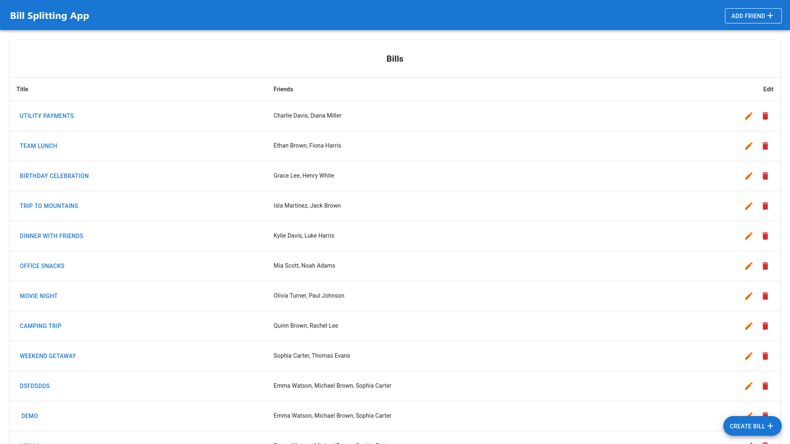
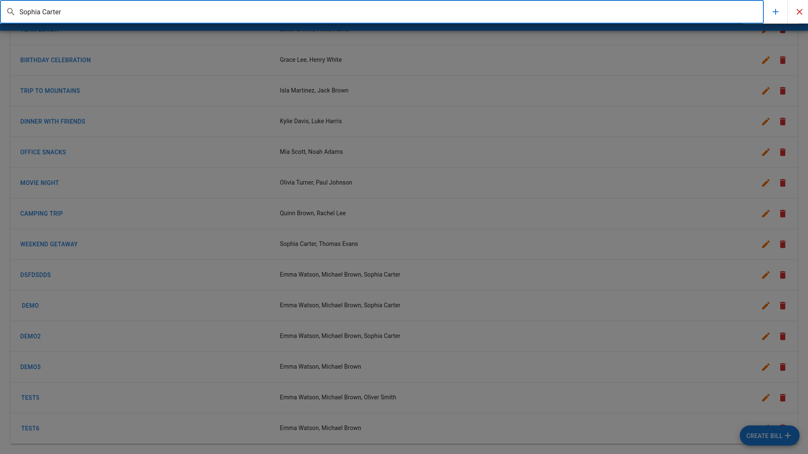
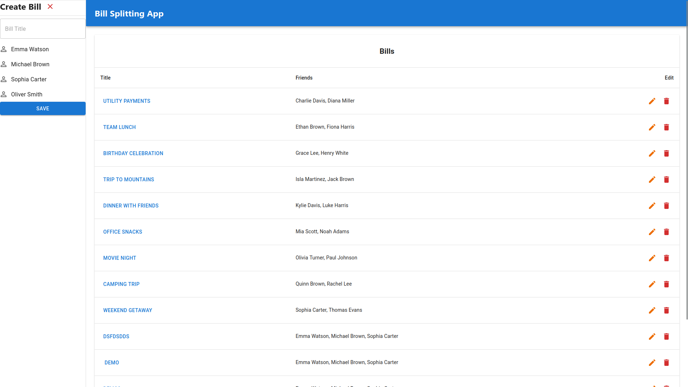
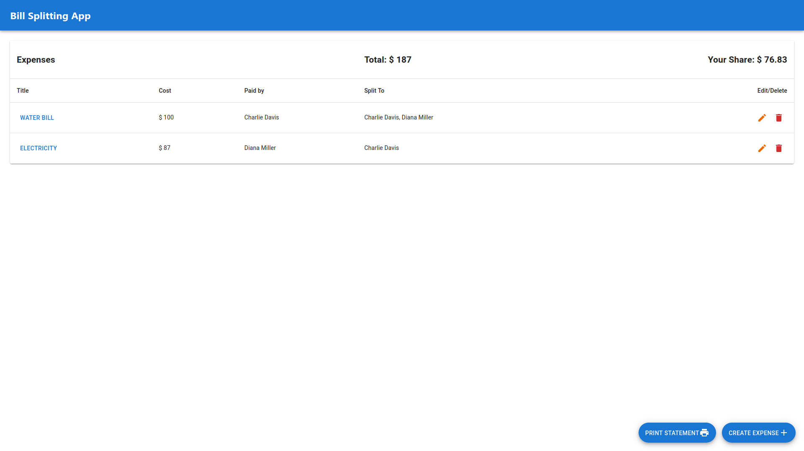
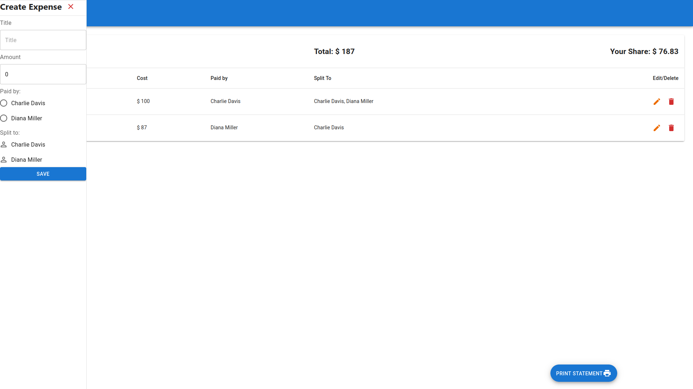

# Bill Splitting Application

This project is a Bill Splitting application that allows users to manage shared expenses, create bills, and track who owes what. The application is built with a **React** frontend, a **Java Spring Boot** backend, and uses **MongoDB** as its database.

## Table of Contents

- [Overview](#overview)
- [Architecture](#architecture)
- [Technologies](#technologies)
- [Features](#features)
- [Getting Started](#getting-started)
- [Prerequisites](#prerequisites)
- [Backend Setup](#backend-setup)
- [Frontend Setup](#frontend-setup)
- [Running the Application](#running-the-application)
- [User Interface](#using-the-app)
- [API Endpoints](#api-endpoints)

## Overview

The Bill Splitting Application allows users to:
- Create and manage bills.
- Add users and expenses to bills.
- Fetch, update, or delete bill details.

On the login page, users can enter credentials to log into an account, or create one if they do not have one yet.
On the main page, the users bills are listed. 
- The user can add friends by pressing the ADD FRIENDS button, typing in another username, and clicking the add button.
- The user can add bills by pressing the CREATE BILL button, filling out the form drawer, and clicking CREATE BILL.
- The user can edit bills by pressing the edit button in the bill list, then filling out the form as they did to create the bill.
- The user can delete bills by pressing the delete button in the bill list.
- The user can see the details of a bill's expenses by clicking on the title of the bill.
On the page listing expenses for a particular bill, the user can do the same actions on expenses as described above for bills, with the exception that the user cannot add friends or click on the title.

## Architecture

The Bill Splitting Application allows users to:
- **Controller Layer**: Handles HTTP requests (e.g., /api/bills).
- **Service Layer**: Encapsulates business logic (e.g., validating expenses).
- **Repository Layer**: Performs database operations (CRUD) using MongoDB.
- **Data Models**: Defines objects like Bill, Expense, and User.

## Technologies

- **Backend**: Java, Spring Boot, MongoDB
- **Frontend**: React, HTML/CSS
- **Database**: MongoDB

## Features

- User management: Create and manage users.
- Bill management: Create bills that include multiple expenses and users.
- Expense tracking: Add expenses to bills, and split the cost among users.
- API for interacting with users, bills, and expenses.

## Getting Started

To get a copy of the project up and running on your local machine, follow the instructions below.

## Prerequisites

- **Java JDK** (version 17 or higher)
- **Node.js** (version 18 or higher)
- **MongoDB** (local instance or cloud-based MongoDB Atlas)
- **Maven** for building the backend

## Backend Setup

1. **Clone the repository**:

   ```bash
   git clone https://github.com/yourusername/bill-splitting-app.git
   cd bill-splitting-app/backend
   ```

2. **Configure MongoDB**:

   ````bash
   Ensure MongoDB is running locally or provide your MongoDB URI. Update the application.properties file in the src/main/resources/ folder with the MongoDB connection details:
   spring.data.mongodb.uri=mongodb+srv://<username>:<password>@cluster0.mongodb.net/billsplitter?retryWrites=true&w=majority
   ````

3. **Build and run the backend**:
   ```bash
   mvn clean install
   mvn spring-boot:run
   ```

## Frontend Setup

1. **Navigate to the frontend directory**:

   ```bash
   cd ../frontend
   ```

2. **Install dependencies**:

   ```bash
   npm install
   ```

3. **Run the frontend server**:
   ```bash
   npm start
   ```

**The frontend will be accessible at http://localhost:3000**

## Running the Application

1. **Ensure the backend server is running** on port 8080 as described in the backend setup.
2. **Ensure the frontend server is running** on port 3000 as described in the frontend setup.
3. **Access the application**:
   - Open your web browser and go to `http://localhost:3000` to start using the Bill Splitting app.

## User Interface


Open opening the app, you will be greeted with the home page. This page displays all of your bills. To add friends, you can press the "Add Friend" button at the top right. You can press the floating "Create Bill" button on the bottom right to create a bill. You can click into the title of each bill to view its expenses, press the pen icon on the right to edit or the trash can icon on the right to delete.


After pressing the "Add Friend" button at the top right, you will be see a text field that allows you to type the name of your friend. Press the "+" to add the friend. They can only be added if they have a user profile with the app's database. The image shows a test user that is in the database.


After pressing the "Create Bill" button, a drawer will show up on the left for you to create a blank bill and select from your list of friends. Press "Save" to create the bill and press the "X" to cancel. Editing a bill works the same way except the fields are automatically filled with information from the bill.


When you click the title of a bill, you will enter the bill page for that bill. This page displays all expenses on that bill. Edit and delete button are the same as from the home page. The top of the list displays the total for the bill as well as what you owe for all expenses combined assuming each expense is also split to the user that can see the expense. You can also press the floating "Print Statement" button on the bottom right to print a copy of the bill.


After pressing the "Create Expense" button, a drawer will show up on the left for you to create an expense, select which user in the bill paid for the expense and which users the bill is split to. Press "Save" to create the expense and press the "X" to cancel. Editing an expense works the same way except the fields are automatically filled with information from the expense.

## API Endpoints

The backend exposes the following REST API endpoints:

### Users

- `GET /api/users` - Retrieve all users
- `POST /api/users` - Create a new user
- `POST /api/users/{id}/friends/{friendId}` - Add a friend to user by user and friend ObjectId
- `GET /api/users/{id}` - Retrieve a user by ObjectId
- `PUT /api/users/{id}` - Update user information by ObjectId
- `DELETE /api/users/{id}` - Delete a user by ObjectId

### Bills

- `GET /api/bills` - Retrieve all bills
- `POST /api/bills` - Create a new bill
- `GET /api/bills/{id}` - Retrieve a bill by ObjectId
- `PUT /api/bills/{id}` - Update a bill by ObjectId
- `DELETE /api/bills/{id}` - Delete a bill by ObjectId

### Expenses

- `POST /api/expenses` - Create a new expense
- `GET /api/expenses` - Retrieve all expenses
- `GET /api/expenses/{id}` - Retrieve an expense by ObjectId
- `PUT /api/expenses/{id}` - Update an expense by ObjectId
- `DELETE /api/expenses/{id}` - Delete an expense by ObjectId
